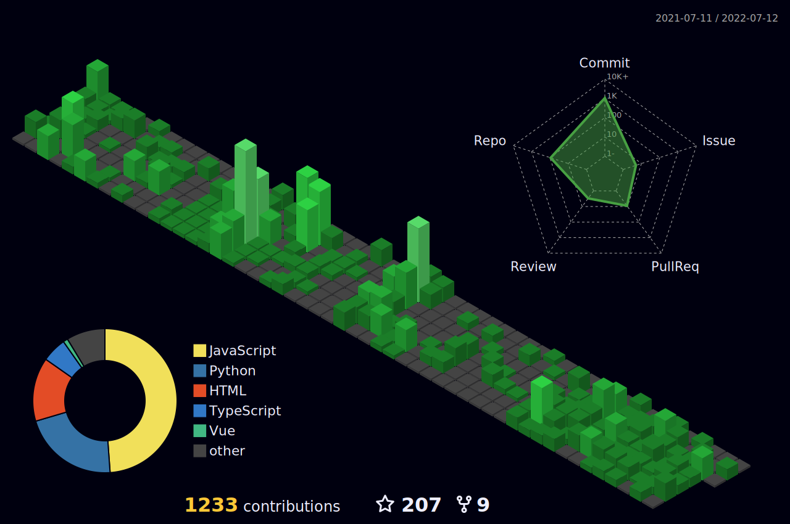

# Hello 👋
## A Senior Frontend enginner

I am currently working remotely.

❤️ **Constantly learning** ❤️

I am a senior frontend engineer
 He is an accomplished software engineer, highly skilled in both front-end and back-end web development. He is friendly, cooperative, and adaptive, which allows him to blend into any team and project with ease. He is also a highly motivated and hardworking person who delivers outstanding work in an organized, reliable, and consistent manner.

### About Me
#### Main Skills

### Git Work

